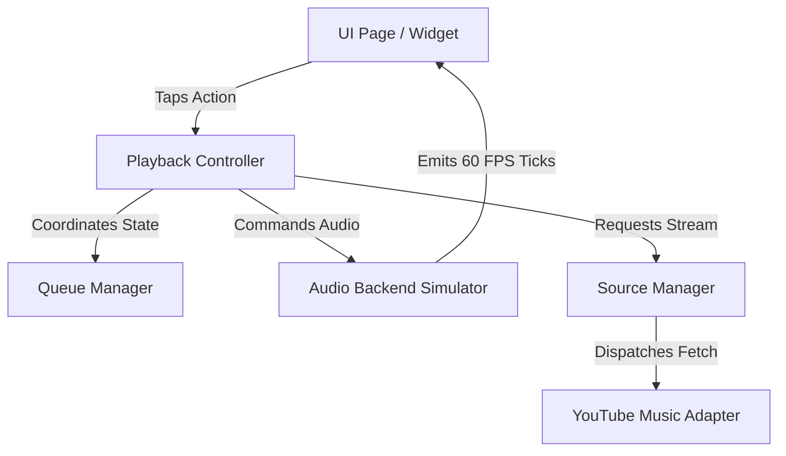

# DA Music: Architecture Overview 🏗️

This document outlines the core architecture and folder structure designed for DA Music.

## Core Design Principles

1. **Strict Separation of Concerns**: Layout, playback control, source adapters, and persistence are decoupled. Changing the playback library or database implementation does not affect the UI or source layers.
2. **Event-Driven Playback**: The UI communicates solely with the playback controller, which emits granular playback events to drive animation and state changes.
3. **Pluggable Source Model**: All music providers implement the same abstract `MusicSourceAdapter` interface, allowing developers to add new adapters without altering existing code.
4. **Adaptive Presentation**: The UI dynamically alters its navigation and layouts according to device window widths, ensuring responsive views on Windows (rail) and Android (bottom navigation bar).

## Folder Structure

```text
lib/
├── app/
│   ├── router/          # GoRouter definitions
│   └── theme/           # Tokens and light/dark ThemeData configurations
├── core/
│   ├── extensions/      # Context shortcuts (daColors, daTypography)
│   ├── exceptions/      # PlaybackException, SourceException, QueueException
│   └── services/        # Business logic services (audio, platform, sources, storage)
├── features/
│   ├── home/            # Greeting headers, recently played lists
│   ├── player/          # Standard panel, immersive fullscreen and MiniPlayer widgets
│   ├── settings/        # Theme toggles and cache flush settings
│   └── (favorites, etc) # Feature sub-modules
└── shared/
    ├── animations/      # Centralized MotionSystem and scale transitions
    ├── models/          # Freezed data models (music, search, feeds, states)
    ├── providers/       # Riverpod global state providers
    └── widgets/         # DACard, custom title bars, shimmers and skeleton loaders
```

## State & Flow Architecture


