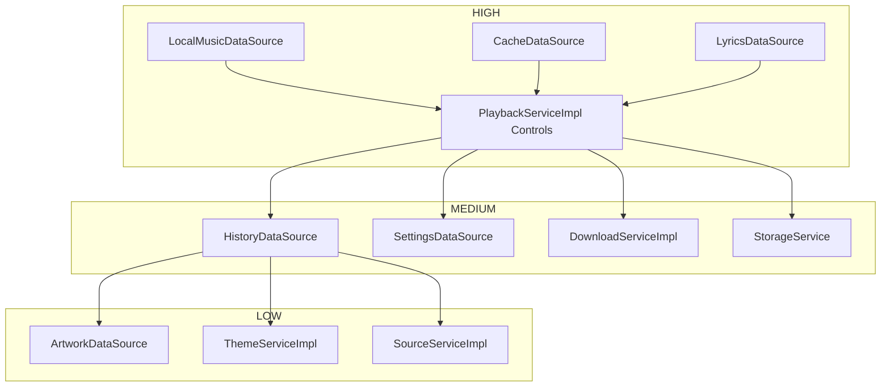

# DA Music — Implementation Audit Report

This audit details every mock class, fake data source, stub implementation, `TODO`, and `UnimplementedError` in the project. It outlines a prioritized roadmap to replace technical debt with production-ready implementations.

---

## 1. Summary of Technical Debt

| Category | Count | Status |
| :--- | :---: | :---: |
| **Mock Classes** | 1 | Kept for testing |
| **UnimplementedErrors** | 8 | Needs production implementation |
| **Empty Stubs & Fakes** | 5 | Return dummy data / empty actions |
| **TODO Comments** | 0 | Clean |

---

## 2. Detailed Audit Log

### HIGH PRIORITY

#### 1. LocalMusicDataSource
*   **File**: [backend_providers.dart](file:///C:/Users/vikrantrajput/./.gemini/antigravity/scratch/da_music/lib/shared/providers/backend_providers.dart)
*   **Class**: `localMusicDataSourceProvider`
*   **Method**: Provider factory
*   **Purpose**: Provider throws `UnimplementedError` instead of returning a Drift database SQLite source mapper.
*   **Replacement Priority**: HIGH (Needed for library, favorites, and playlist persistence).
*   **Estimated Difficulty**: MEDIUM (Requires mapping entity objects to Drift companions).
*   **Dependencies**: `AppDatabase` (Drift).

#### 2. CacheDataSource
*   **File**: [backend_providers.dart](file:///C:/Users/vikrantrajput/./.gemini/antigravity/scratch/da_music/lib/shared/providers/backend_providers.dart)
*   **Class**: `cacheDataSourceProvider`
*   **Method**: Provider factory
*   **Purpose**: Provider throws `UnimplementedError`. Cache Engine needs a persistent backend database cache source.
*   **Replacement Priority**: HIGH (Minimizes network usage).
*   **Estimated Difficulty**: EASY (Uses simple key-value table).
*   **Dependencies**: `AppDatabase` (Drift).

#### 3. LyricsDataSource
*   **File**: [backend_providers.dart](file:///C:/Users/vikrantrajput/./.gemini/antigravity/scratch/da_music/lib/shared/providers/backend_providers.dart)
*   **Class**: `lyricsDataSourceProvider`
*   **Method**: Provider factory
*   **Purpose**: Provider throws `UnimplementedError`.
*   **Replacement Priority**: HIGH (Required for storing offline lyrics).
*   **Estimated Difficulty**: EASY (Single table select/insert).
*   **Dependencies**: `AppDatabase` (Drift).

#### 4. PlaybackServiceImpl (Stubs)
*   **File**: [service_impls.dart](file:///C:/Users/vikrantrajput/./.gemini/antigravity/scratch/da_music/lib/core/services/impl/service_impls.dart)
*   **Class**: `PlaybackServiceImpl`
*   **Method**: `pause`, `resume`, `seek`
*   **Purpose**: Stubs perform empty operations without routing actions to `PlaybackEngine` / `PlatformAudioBackend`.
*   **Replacement Priority**: HIGH (Crucial for music player controls).
*   **Estimated Difficulty**: MEDIUM (Requires coordinating states and player controls).
*   **Dependencies**: `PlaybackEngine`.

---

### MEDIUM PRIORITY

#### 5. HistoryDataSource
*   **File**: [backend_providers.dart](file:///C:/Users/vikrantrajput/./.gemini/antigravity/scratch/da_music/lib/shared/providers/backend_providers.dart)
*   **Class**: `historyDataSourceProvider`
*   **Method**: Provider factory
*   **Purpose**: Provider throws `UnimplementedError`.
*   **Replacement Priority**: MEDIUM (Needed for tracking user listening history).
*   **Estimated Difficulty**: EASY (Inserts logs into a history table).
*   **Dependencies**: `AppDatabase` (Drift).

#### 6. SettingsDataSource
*   **File**: [backend_providers.dart](file:///C:/Users/vikrantrajput/./.gemini/antigravity/scratch/da_music/lib/shared/providers/backend_providers.dart)
*   **Class**: `settingsDataSourceProvider`
*   **Method**: Provider factory
*   **Purpose**: Provider throws `UnimplementedError`.
*   **Replacement Priority**: MEDIUM (Required for persistent volume and dark mode settings).
*   **Estimated Difficulty**: EASY (Uses shared preferences or custom table).
*   **Dependencies**: `AppDatabase` (Drift).

#### 7. DownloadServiceImpl (Stubs)
*   **File**: [service_impls.dart](file:///C:/Users/vikrantrajput/./.gemini/antigravity/scratch/da_music/lib/core/services/impl/service_impls.dart)
*   **Class**: `DownloadServiceImpl`
*   **Method**: `downloadSong`, `pauseDownload`, `resumeDownload`, `cancelDownload`
*   **Purpose**: Actions are empty stubs. Does not implement offline downloads pipeline.
*   **Replacement Priority**: MEDIUM (Required for offline listening feature).
*   **Estimated Difficulty**: HARD (Requires concurrent file downloads and progress tracking).
*   **Dependencies**: `LibraryService`, `HttpClient`.

#### 8. StorageService (Unimplemented)
*   **File**: [library_providers.dart](file:///C:/Users/vikrantrajput/./.gemini/antigravity/scratch/da_music/lib/shared/providers/library_providers.dart)
*   **Class**: `storageServiceProvider`
*   **Method**: Provider factory
*   **Purpose**: Throws `UnimplementedError` expecting ProviderScope overrides.
*   **Replacement Priority**: MEDIUM (Decouples storage path management).
*   **Estimated Difficulty**: EASY (Maps local directories).
*   **Dependencies**: `path_provider` package.

---

### LOW PRIORITY

#### 9. ArtworkDataSource
*   **File**: [backend_providers.dart](file:///C:/Users/vikrantrajput/./.gemini/antigravity/scratch/da_music/lib/shared/providers/backend_providers.dart)
*   **Class**: `artworkDataSourceProvider`
*   **Method**: Provider factory
*   **Purpose**: Provider throws `UnimplementedError`.
*   **Replacement Priority**: LOW (Aesthetic only; remote sources already yield images).
*   **Estimated Difficulty**: EASY (Returns generic query links or maps metadata).
*   **Dependencies**: Remote API/Unsplash.

#### 10. CacheService
*   **File**: [backend_providers.dart](file:///C:/Users/vikrantrajput/./.gemini/antigravity/scratch/da_music/lib/shared/providers/backend_providers.dart)
*   **Class**: `cacheServiceProvider`
*   **Method**: Provider factory
*   **Purpose**: Throws `UnimplementedError`. (Note: Redundant because network caching is handled by `Smart Cache Engine & Request Manager` directly).
*   **Replacement Priority**: LOW (Can be deleted or simplified).
*   **Estimated Difficulty**: EASY (Decoupling placeholder).
*   **Dependencies**: None.

#### 11. ArtworkServiceImpl (Fake)
*   **File**: [service_impls.dart](file:///C:/Users/vikrantrajput/./.gemini/antigravity/scratch/da_music/lib/core/services/impl/service_impls.dart)
*   **Class**: `ArtworkServiceImpl`
*   **Method**: `getArtworkUrl`
*   **Purpose**: Returns `null` placeholder.
*   **Replacement Priority**: LOW (Cosmetic cover art fallback).
*   **Estimated Difficulty**: EASY (Fetches cover links).
*   **Dependencies**: `ArtworkDataSource`.

#### 12. ThemeServiceImpl (Stubs)
*   **File**: [service_impls.dart](file:///C:/Users/vikrantrajput/./.gemini/antigravity/scratch/da_music/lib/core/services/impl/service_impls.dart)
*   **Class**: `ThemeServiceImpl`
*   **Method**: `setAccentColor`, `toggleDarkMode`
*   **Purpose**: Stubs perform empty operations. Does not persist configurations.
*   **Replacement Priority**: LOW (Cosmetic preferences).
*   **Estimated Difficulty**: EASY (Coordinates Riverpod theme provider state).
*   **Dependencies**: None.

#### 13. SourceServiceImpl (Stubs)
*   **File**: [service_impls.dart](file:///C:/Users/vikrantrajput/./.gemini/antigravity/scratch/da_music/lib/core/services/impl/service_impls.dart)
*   **Class**: `SourceServiceImpl`
*   **Method**: `selectSource`, `getAvailableSources`
*   **Purpose**: Does not coordinate Pluggable Sources or adapters.
*   **Replacement Priority**: LOW (Only needed when adding future platforms like Spotify).
*   **Estimated Difficulty**: EASY (Calls `SourceManager`).
*   **Dependencies**: `SourceManager`.

#### 14. MockPlaybackEngine (Mock)
*   **File**: [mock_playback_engine.dart](file:///C:/Users/vikrantrajput/./.gemini/antigravity/scratch/da_music/lib/core/services/impl/mock_playback_engine.dart)
*   **Class**: `MockPlaybackEngine`
*   **Method**: All methods
*   **Purpose**: Simulates status updates and playback progress loops.
*   **Replacement Priority**: LOW (Not used in runtime; kept for unit testing playback).
*   **Estimated Difficulty**: None (Already implemented).
*   **Dependencies**: None.

---

## 3. Prioritized Implementation Roadmap

