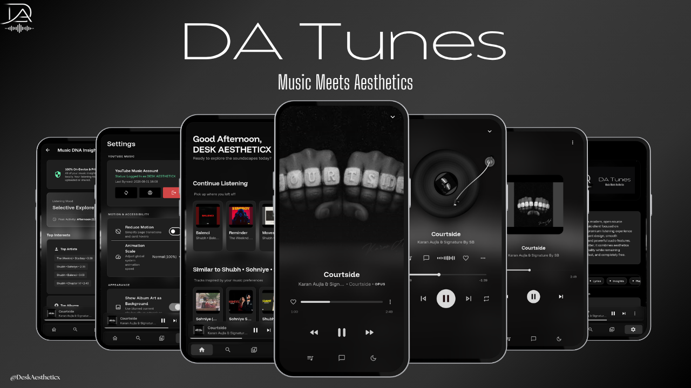
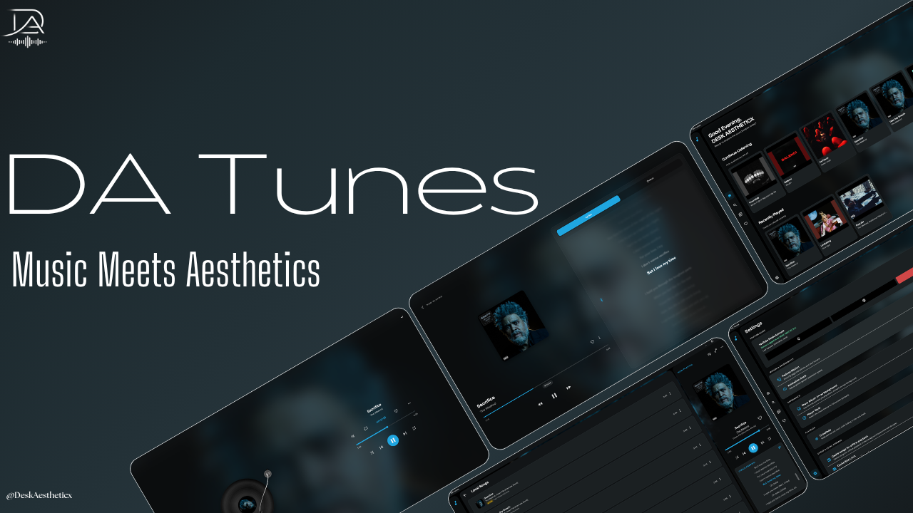

# DA Tunes

DA Tunes is a thoughtfully crafted cross-platform music player built with Flutter, designed to deliver a fast, elegant, and uninterrupted listening experience on Android and Windows.

By combining a refined interface with a modern playback engine, DA Tunes focuses on smooth performance, intelligent music discovery, and an experience that feels polished from the first launch.

## Highlights

- YouTube Music integration with YT music account login support
- Native support for Android and Windows
- Multiple player styles
- Smart recommendations
- Lyrics support
- Offline downloads
- Home screen widgets
- Dynamic artwork-based theming
- Sleep timer
- Crossfade playback
- Queue management
- Hi-Res and lossless files support for offline playback

## UI
### Android


### Windows



## Built With

- Flutter
- Dart

## Getting Started

```bash
git clone https://github.com/VikrantRuhela/DA-Tunes.git
cd DA-Tunes
flutter pub get
flutter run
```

## License

Licensed under the GNU General Public License v3.0 (GPL-3.0). See the `LICENSE` file for more information.
